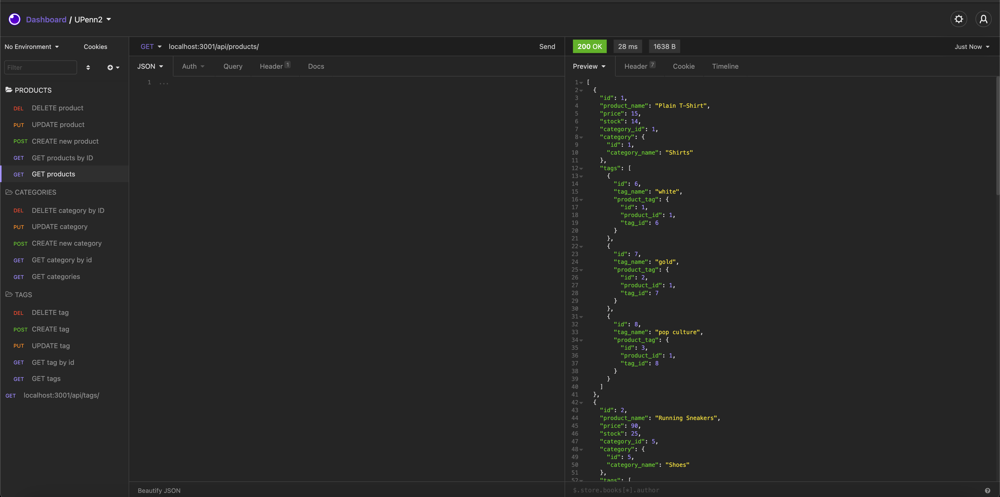
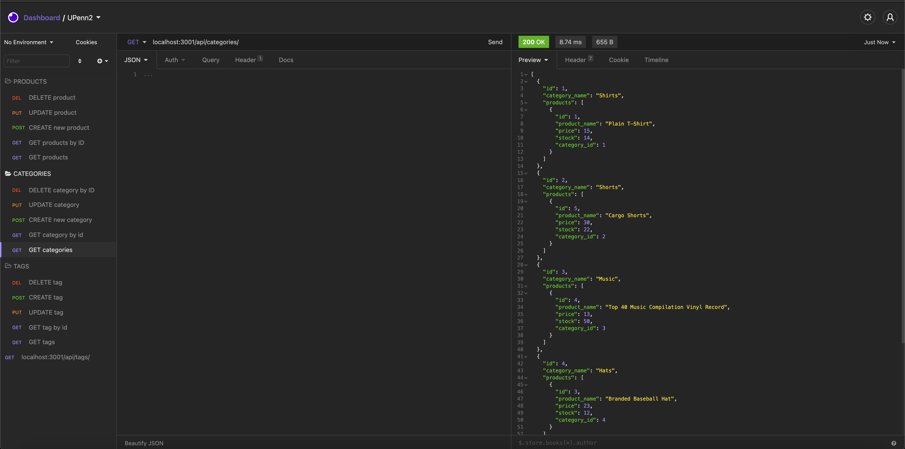
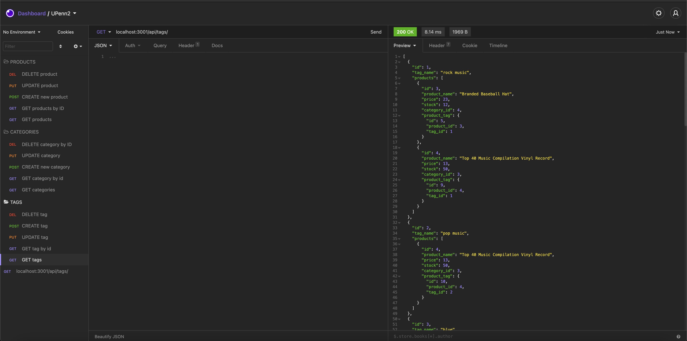

# e-commerce-back-end

## Approach 

This e-commerce back end application is comprised of many working parts that all seamlessly come together to build a polished application that seamlessly works with the databse to store and update data based of different CRUD functionality. The application is seeded data and from there the user is able to maniupluate the data however they see fit. All of the data is stored in the MySQL database and is dynamically updated based on what the user does, from creating new data, reading that data based off all, or specific id's, update the data they have already stored and finally delete data that is no longer needed. Those 4 steps make this a full CRUD application, the functions that run these are GET, POST, PUT and DELETE. This application does not compromise a front end where the user would usually intercat with it, so to simulate that we use Insomnia to try and produce what the user would be doing on the webpage. I was able to succesfully do all of the functionality and testing on Insomnia to ensure the application was fully functional and that the database reflected all of the changes that were being made.

## Installation

To install this repo on your local drive you would have to clone the ssh key from my repo. Head into your local drive of choice in terminal or bash and do a git clone. Once you have done a git clone you are free to start working on this project. If you want to push your changes to my repo then you would have to head into terminal/bash and do a git add . Then a git commit -m explaning the changes made, and finally a git push to push the files onto the repo. 

## Usage 

If you want to use this program, first do a git clone as previously described. Then do a npm inint -y to get a package.json file, from there we can start installing the dependencies needed for this project. The dependencies you will need are sequlize, express and dotenv. These are installed doing the corresponding npm installs. From there you can start working on this project as long as you have MySql, MySQL Workbench and Insomnia installed. Now that your node modules are installed you can run this program by starting the server and making sure it is listening, after that seed the database by running the command node seeds/index.js. Once the databse is seeded you can start to do CRUD functionality by using the appropriate url's in Insomnia. This will allow you to start manipulating the data and adding, deleting and updating data however the user wishes. The following section has a demonstartion video.

## Finished project
 If you would like a demo of this program, visit https://youtu.be/wT1kkGHjRiw

## Features
<ul>
<li>Application is a functional Express.js API.</li>
<li>Features full CRUD functionality.</li>
<li>Uses an environment variable file to store database name, MySQL username, and MySQL password.</li>
<li>Application is able to connect to a database using Sequelize</li>
<li>When schema and seed commands are entered.</li>
<li>Then a development database is created and is seeded with test data.</li>
<li>Able to invoke the application using the command line</li>
<li>The server is started and the Sequelize models are synced to the MySQL database</li>
<li>When the API GET routes in Insomnia Core for categories, products, or tags are run</li>
<li>Then the data for each of these routes is displayed in a formatted JSON</li>
<li>When API POST, PUT, and DELETE routes are tested in Insomnia Core</li>
<li>Then the data in the databse is succesfully created, updated, and deleted.</li>

</ul>

## Tests
Using the a combination of the MySQL databse for the backend and Insomnia for the front-end the user is able to test out all of the CRUD functionality in Insomnia and make sure that the database in MySQL is responding in the appropriate fashion. 

## Credits
N/A

## Contributing

Pull requests are welcome and encouraged. Hit me up on my github <a href="https://github.com/mattrward1030">mattrward1030</a>

## Badges
 

## License

MIT License

Copyright (c) [2021] [Matthew Ward]

Permission is hereby granted, free of charge, to any person obtaining a copy
of this software and associated documentation files (the "Software"), to deal
in the Software without restriction, including without limitation the rights
to use, copy, modify, merge, publish, distribute, sublicense, and/or sell
copies of the Software, and to permit persons to whom the Software is
furnished to do so, subject to the following conditions:

The above copyright notice and this permission notice shall be included in all
copies or substantial portions of the Software.

THE SOFTWARE IS PROVIDED "AS IS", WITHOUT WARRANTY OF ANY KIND, EXPRESS OR
IMPLIED, INCLUDING BUT NOT LIMITED TO THE WARRANTIES OF MERCHANTABILITY,
FITNESS FOR A PARTICULAR PURPOSE AND NONINFRINGEMENT. IN NO EVENT SHALL THE
AUTHORS OR COPYRIGHT HOLDERS BE LIABLE FOR ANY CLAIM, DAMAGES OR OTHER
LIABILITY, WHETHER IN AN ACTION OF CONTRACT, TORT OR OTHERWISE, ARISING FROM,
OUT OF OR IN CONNECTION WITH THE SOFTWARE OR THE USE OR OTHER DEALINGS IN THE
SOFTWARE.
